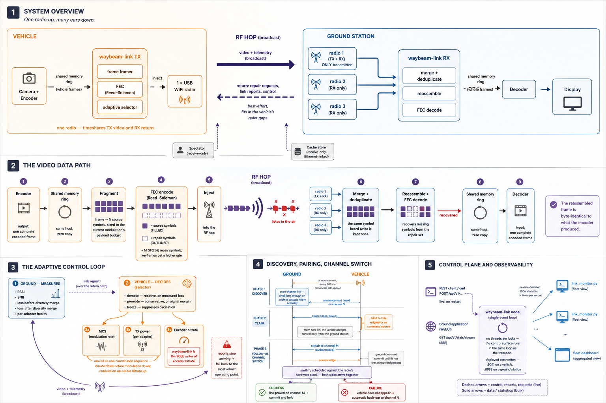

# waybeam-link

**A latency-first digital video link for drones and remote vehicles, built on
raw 802.11 injection.**

waybeam-link carries live video, telemetry and control between a vehicle and
one or more ground stations over ordinary USB WiFi adapters — with no access
point, no association, no TCP, and no kernel WiFi stack in the path. It is
designed around a single priority: **a frame that arrives late is worse than a
frame that never arrives at all.**

```
  camera ─► encoder ─► waybeam-link ─► ((( RF ))) ─► waybeam-link ─► decoder ─► screen
            (vehicle)                                  (ground)
```

See it run without owning a radio:

```sh
cmake --preset dev && cmake --build --preset dev -j
./build/dev/waybeam-link loopback -c examples/config.loopback.sample.json
```

> **Status: working on real hardware, not yet a shipping product.**
> The transport, the adaptive link layer, FEC, ARQ, the follow-me channel
> switch and the discovery/pairing path are implemented, unit-tested and
> verified end to end over real RF. Field range validation and the stability of
> the adaptive loop under sustained flight are still open. See
> [Maturity](#maturity) for the honest breakdown.

**Where this sits.** waybeam-link is the radio layer of the Waybeam FPV
ecosystem. It does not encode video and it does not decode it — it moves what
an encoder produces to wherever a decoder is waiting. On the vehicle it runs
next to `waybeam_venc` (the camera/encoder daemon); on the ground its output
feeds a decoder such as `waybeam-hub`, the Android ground station, or any
consumer of its shared-memory ring. It is usable on its own with any encoder
that can write whole frames into shared memory, or with a plain RTP source.

---

## Table of contents

- [Why this exists](#why-this-exists)
- [The design in one page](#the-design-in-one-page)
- [Architecture](#architecture)
  - [The node model](#the-node-model)
  - [The video path](#the-video-path)
  - [The return path](#the-return-path)
  - [The adaptive link layer](#the-adaptive-link-layer)
  - [Loss recovery: diversity, FEC, ARQ](#loss-recovery-diversity-fec-arq)
  - [Discovery, pairing and the follow-me channel switch](#discovery-pairing-and-the-follow-me-channel-switch)
  - [Operating modes](#operating-modes)
- [Hardware](#hardware)
- [Getting started](#getting-started)
- [Configuration](#configuration)
- [Control plane and observability](#control-plane-and-observability)
- [Using it as a library](#using-it-as-a-library)
- [Building](#building)
- [Maturity](#maturity)
- [Where this is going](#where-this-is-going)
- [Documentation map](#documentation-map)
- [Contributing](#contributing)
- [Licensing and credits](#licensing-and-credits)

---

## Why this exists

You are flying something you can only see through its camera. What you need
from the link is not throughput and not perfect delivery — it is that what you
see is *happening now*. Analogue FPV gets this right and degrades gracefully.
Digital FPV is sharper but usually degrades catastrophically, because a WiFi
link built on association, retries and buffering will happily spend a third of
a second delivering a frame you no longer care about.

Broadcast injection links solve this by throwing away the parts of 802.11 that
buy reliability at the cost of time: no association, no MAC-layer ARQ, no
rate-adaptation state machine hidden in a driver. waybeam-link belongs to that
family — the same lineage as [wfb-ng](https://github.com/svpcom/wfb-ng) and
OpenIPC — but it makes a different set of trades:

| | Typical injection link | waybeam-link |
|---|---|---|
| Primary redundancy | Forward error correction | **Multi-adapter receive diversity** |
| Repair of short fades | More FEC overhead | **Opportunistic, deadline-aware ARQ** |
| Unit of transport | Fixed-size packet blocks | **Whole encoded video frames** |
| Rate control | Radio and encoder tuned separately | **One controller owns MCS + TX power + encoder bitrate** |
| Kernel WiFi driver | Required (monitor mode) | **Not used** — userspace USB driver |
| Session model | Keyed, paired | **Open broadcast, anyone may watch** |

The result is a link where the common case — a brief fade — is repaired by a
targeted retransmission that still arrives in time to be displayed, while the
hard case — a real drop in signal strength — is absorbed by having more than one
antenna listening, rather than by paying FEC overhead on every frame forever.

**Deliberate non-goals.** waybeam-link is not encrypted, not authenticated on
the data path, and not a general-purpose network device. It broadcasts. It
assumes a clear-ish band, one vehicle at a time, and an operator who owns the
spectrum they are transmitting in. See §13 and §18 of
[`PROTOCOL.md`](PROTOCOL.md).

---

## The design in one page

Five ideas carry almost everything else:

**1. The vehicle has one radio. The ground has several.**
A physical constraint, not a configuration choice. The vehicle timeshares its
single adapter between sending video and listening for the ground, which is why
the return path is best-effort by physics. Diversity is a ground-only
capability.

**2. Video is transported as frames, not as packets.**
Because the transport knows where frame boundaries are, it can decide per
frame: how much redundancy this one deserves, whether it is worth
retransmitting, and when it is too late to bother.

**3. Everything is broadcast; nothing is negotiated.**
No handshake, no session setup. A vehicle transmits; any receiver in range may
decode it. Receivers latch on passively, and control traffic is addressed to a
stable node ID rather than to a MAC address or a connection.

**4. The receiver measures; the transmitter decides.**
Ground stations report what they are actually seeing. The vehicle collects
those reports and runs one control loop that picks modulation, transmit power
*and* encoder bitrate together, as a single operating point.

**5. Changing channel is a coordinated manoeuvre, not a reconnect.**
The vehicle cannot be in two places at once, so moving frequency is a
"follow-me" switch: authenticated, scheduled so both ends arrive together, and
backed out automatically if the vehicle fails to show up.

---

## Architecture

[](docs/images/architecture.png)

<sup>Click for full size. The five panels map to the five sections below.</sup>

### The node model

Every waybeam-link process is a **node** with a stable numeric identity and a
role. Nodes see each other's broadcasts; roles describe intent, not permission.

| Node | Radios | Transmits | Purpose |
|---|---|---|---|
| **Craft** (vehicle) | 1 | Video, telemetry | The camera platform. Runs alongside the encoder. |
| **Ground** (receiver) | N (1 must be TX-capable) | Return traffic only | The pilot's station. Merges diversity, owns pairing and control. |
| **Spectator** | N (all receive-only) | Nothing | A second screen. Watches without touching the link. |
| **Cache store** | N (all receive-only) | Nothing over RF | A listening post placed elsewhere and wired back over Ethernet, extending coverage without adding another transmitter. |

Because the medium is broadcast, extra receivers are first-class — a spectator
adds no load to the link and needs nobody's permission. What *is* arbitrated is
repair: the vehicle serves retransmission requests to one receiver at a time, so
a room full of spectators cannot storm the return path.

### The video path

```
                    VEHICLE                              GROUND
  ┌──────────┐   shared    ┌──────────────┐         ┌──────────────┐   shared   ┌─────────┐
  │ encoder  │─── memory ─►│ waybeam-link │         │ waybeam-link │── memory ─►│ decoder │
  │  (venc)  │   ring      │      TX      │         │      RX      │   ring     │         │
  └──────────┘             └──────┬───────┘         └──────▲───────┘            └─────────┘
                                  │                        │
                       fragment into source symbols   merge N adapters,
                       + GF(256) repair symbols       dedup, reassemble,
                                  │                   FEC-decode
                                  ▼                        │
                            ┌───────────┐   ((( RF )))  ┌──┴──┐ ┌─────┐ ┌─────┐
                            │  1 radio  │──────────────►│ rx1 │ │ rx2 │ │ rx3 │
                            └───────────┘               └─────┘ └─────┘ └─────┘
```

The encoder publishes each completed frame into a shared-memory ring.
waybeam-link splits it into **source symbols**, adds **repair symbols**, and
injects the lot. On the ground, symbols arriving on any adapter feed one merged
receive state machine that deduplicates, reassembles the frame, repairs it from
the FEC if symbols were lost, and hands it to the decoder through a
shared-memory ring on that side.

The frame that comes out is byte-identical to the one that went in.

Video can also arrive as ordinary **RTP over UDP**, if you are feeding
waybeam-link from GStreamer or an existing pipeline. The transport treats RTP as
opaque — the only codec awareness anywhere in the system is a small classifier
deciding whether a packet is important enough to be worth retransmitting.

The same wire also carries **telemetry**, **control** (RC uplink) and **audio**,
each with its own delivery discipline.

### The return path

The vehicle can only hear the ground while its own radio is not transmitting.
So the vehicle advertises its quiet gaps, timed against the radio's own clock,
and the ground aims its return traffic into them. Everything travelling
upstream — retransmission requests, link reports, channel-switch commands, RC
and telemetry uplink — shares that narrow window, in a strict priority order.

This is why one ground adapter is appointed the **uplink transmitter**: while it
is transmitting it is deaf, and its diversity siblings cover the blind spot.

### The adaptive link layer

```
   ground: measure                        vehicle: decide
   ┌────────────────────┐  link report   ┌──────────────────────┐
   │ RSSI / SNR         │───────────────►│  selector            │
   │ pre-diversity loss │                │   ├─ demote on loss  │
   │ post-diversity loss│                │   ├─ promote on margin│
   │ per-adapter health │                │   └─ freeze on flap  │
   └────────────────────┘                └──────────┬───────────┘
                                                    │  one operating point
                                    ┌───────────────┼───────────────┐
                                    ▼               ▼               ▼
                                  MCS          TX power        encoder bitrate
                            (modulation)    (per adapter)     (via local API)
```

One controller on the vehicle owns all three knobs and moves them in a
coordinated order — bitrate down *before* modulation down, modulation up
*before* bitrate up — so the link never spends a moment asking the radio to
carry more than it can. It backs off quickly when loss appears, climbs back only
when the evidence says the next rung will hold, refuses to oscillate, and falls
to its most robust setting if the ground's reports stop arriving altogether.

**waybeam-link is the sole owner of the encoder's bitrate.** The encoder has no
arbitration — last writer wins — so nothing else in the system may write it
while waybeam-link is running. This is a hard deployment invariant.

### Loss recovery: diversity, FEC, ARQ

Three mechanisms, deliberately layered, each aimed at a different failure shape:

| Mechanism | Repairs | Cost | Role |
|---|---|---|---|
| **Receive diversity** | Loss that hits one antenna but not the others | Extra adapters | **Primary.** Load-bearing. |
| **FEC** (GF(256) Reed–Solomon) | Scattered symbol loss within a frame | Constant airtime overhead | Configurable per stream, higher rate on keyframes |
| **ARQ** (retransmission) | Brief fades that hit every antenna at once | Return-path airtime, only when needed | **Opportunistic.** Never load-bearing. |

The ordering matters. ARQ is explicitly *not* a reliability guarantee: it only
asks for frames worth repairing, it never sends a repair that cannot arrive in
time, and it quietly does less as the channel fills up. When the link is in real
trouble, waybeam-link degrades toward pure diversity — the designed floor, not a
failure.

All three have been measured together through a real fade on real hardware. A
second antenna cut the loss the merge had to deal with by most of it; FEC then
recovered the large majority of what remained, with ARQ picking up a useful
remainder. The same run also included a total blackout, which nothing repaired —
when the link is genuinely gone, no amount of redundancy invents it back.

### Discovery, pairing and the follow-me channel switch

A vehicle powers on and broadcasts a periodic announcement on its channel. A
ground station that does not know where the vehicle is **scouts**: it sweeps its
adapters across the allowed channel list, dwelling long enough on each to
actually hear an announcement, and reports what it found.

Pairing is a **claim**: the ground sends a token-keyed claim to the vehicle,
which binds to that originator as its command source. From then on the vehicle
accepts control traffic only from that ground station.

Changing frequency is the delicate part, because the vehicle has one radio and a
mistimed switch means a lost aircraft. The **follow-me channel switch** handles
it as a campaign:

1. Ground announces the target channel, authenticated by a shared key.
2. Vehicle acknowledges — the ground does not commit until it has.
3. Both sides schedule the switch against the radio's hardware clock so they
   arrive together.
4. If the vehicle does not appear on the new channel, it **backs out** to the
   old one automatically.
5. Once the link is proven on the new channel, it is committed and held.

This is the only cryptography in the system, and it is deliberately off the data
path.

### Operating modes

Rather than exposing modulation indices and frame rates to a pilot, each vehicle
ships a small catalog of named **operating modes** — a bundle of resolution,
frame rate and the modulation window the link is allowed to use. The user picks
along two axes:

| Axis | The pilot sees | What it actually sets |
|---|---|---|
| **Latency** | Low / Medium / High | Sensor mode and frame rate (100 / 60 / 30 fps) |
| **Range** | High / Medium / Low | The modulation band the link may select within |

Modes can be applied over HTTP on a bench, or over RF in flight. The ground
carries a fingerprint of the vehicle's catalog so that a mismatch is *detected*
rather than silently applying the wrong mode.

---

## Hardware

**Vehicle side** — one USB WiFi adapter, one SoC running the encoder.
Verified on SigmaStar SSC338Q and HiSilicon CV610 camera boards.

**Ground side** — one to three USB WiFi adapters on x86, ARM64 (RK3566), or
Android.

**Supported radios** — RTL8812AU, RTL8812CU, RTL8812EU and RTL8733BU, all
through the vendored [OpenIPC
devourer](https://github.com/OpenIPC/devourer) userspace driver. All four are
tested and working, on the vehicle side and on the ground side alike; which
chip goes where is your choice.

The kernel driver has to be unloaded before use — devourer talks to the USB
device directly. Adapters are matched by USB bus path, or by the per-unit MAC
burned into the adapter's EFUSE — never by network interface name, which is not
stable across reboots or re-plugs.

---

## Getting started

### Without any radios

Everything but the RF hop runs on one machine. The built-in `loopback` mode
(shown at the top of this page) exercises the whole transport in a single
process. To run two *real* processes against a simulated air interface — one
transmitter, one receiver, with virtual diversity paths and a matched return
path:

```sh
./build/dev/waybeam-link tx -c examples/config.air-tx.sample.json &
./build/dev/waybeam-link rx -c examples/config.air-rx.sample.json
```

With GStreamer installed, `tools/frame_shm_udp_bench.sh` drives the complete
encode → transport → decode chain and validates the result frame by frame —
metadata, byte-exactness, timestamp monotonicity, FEC and ARQ counters.

### With radios

The kernel driver has to release the adapter first, because devourer opens the
USB device directly:

```sh
sudo rmmod <whatever module currently claims your adapter>   # e.g. 88x2cu, rtw88_8812au

sudo ./build/dev/waybeam-link tx -c examples/config.radio-tx.sample.json   # vehicle
sudo ./build/dev/waybeam-link rx -c examples/config.radio-rx.sample.json   # ground
```

Both ends must agree on channel, bandwidth and network ID. Run from the repo
root — the operating-point table is loaded by relative path.

> **Transmitting on 5 GHz is regulated.** You are responsible for operating
> within the rules of your jurisdiction, on frequencies you are licensed to
> use, at power levels you are permitted to radiate.

---

## Configuration

One JSON file per node, covering identity, adapters, streams, policy and
observability:

```json
{
  "node":    { "originator": 17, "net_id": 42, "role": "tx" },
  "adapters": [
    { "name": "craft", "bus": "1-1", "role": "tx", "channel": 5805, "bw": 20 }
  ],
  "air":     { "kind": "radio" },
  "streams": [
    { "stream_id": 0, "stream_type": "RTP", "dir": "in",
      "bind": { "kind": "frame-shm", "name": "venc_frame" },
      "fec":  { "scheme": "rlc256", "i_rate_permille": 250, "p_rate_permille": 100 } }
  ],
  "control": { "bind": "127.0.0.1:8091" },
  "stats":   { "hz": 5 }
}
```

Configs are **coupled across nodes** — network ID, channel, allowed channel
list and originator references have to agree fleet-wide. Validate before
deploying:

```sh
waybeam-link tx -c my-node.json --check --strict   # parses, binds, reports unknown keys
waybeam-link config-schema --json                  # the full declared key surface
```

`--strict` matters: the loader reads keys by name and silently ignores anything
it does not recognise, so a typo loads perfectly cleanly without doing what you
meant. `examples/` holds annotated samples; `deploy/` holds real configs read
back off flying hardware.

---

## Control plane and observability

Every node optionally exposes a small HTTP/1.0 REST surface, folded into the
main event loop — no threads, no locks, no authentication (bind it to localhost
or to a trusted network only).

```sh
curl -s http://127.0.0.1:8091/api/v1/stats | jq .link      # full statistics object
curl -s http://127.0.0.1:8091/api/v1/health                # terse link summary
curl -N http://127.0.0.1:8091/api/v1/stats/stream          # live SSE feed
```

Writes take effect immediately, without a restart:

| Endpoint | Effect |
|---|---|
| `POST /api/v1/link/profile` | Pin or unpin the modulation/bitrate operating point |
| `POST /api/v1/tx/power` | Set transmit power offset |
| `POST /api/v1/fec` | Change FEC rates per stream |
| `POST /api/v1/csa` | Trigger a follow-me channel switch |
| `POST /api/v1/scout/start` · `/quickconnect` | Discover and pair with a vehicle |
| `POST /api/v1/mode` · `GET /api/v1/modes` | Apply / enumerate operating modes |
| `POST /api/v1/vehicle/command` | Send a command to the paired vehicle over RF |
| `POST /api/v1/video/recover` | Request one keyframe to bootstrap a decoder |

Independently of REST, every node emits a newline-delimited JSON statistics
record at a configurable rate. `tools/link_monitor.py` — stdlib Python, no
dependencies — turns that stream into a live browser dashboard for a whole
fleet, with per-adapter signal, per-stream loss before and after diversity, FEC
and ARQ recovery counts, and return-path health.

```sh
python3 tools/link_monitor.py     # dashboard on :8099, stats intake on :9110
```

---

## Using it as a library

waybeam-link is structured so that other applications can embed the link rather
than shell out to a daemon. The Android ground station and the C-based
`waybeam-hub` daemon both do exactly this.

| Layer | Contains | Dependencies |
|---|---|---|
| `core/` | Wire format, receive engine, scheduler, FEC, adaptive selector, channel-switch logic. No sockets, no threads, no wall clock. | C++ standard library only |
| `io/` | Configuration, UDP and shared-memory bindings, the radio backend, statistics, encoder actuation | devourer, libusb |
| `node/` | Runnable node behaviour — a complete receiving or transmitting node you can start from your own process | `core` + `io` |

`node/` also exposes a **C ABI**, because the two real consumers are a C daemon
and an Android app reaching native code through JNI. On unrooted Android, USB
file descriptors come from the Java `UsbManager` and are handed in directly —
there is no device enumeration to do.

```cmake
find_package(wblink)              # gives wblink::core, installable standalone
# or
add_subdirectory(waybeam-link)    # gives wblink::core, wblink::io, wblink::node
```

The wire format is **vendored, not reimplemented**, into every consumer, so
there is exactly one implementation of the packet format in the ecosystem.

---

## Building

```sh
cmake --preset dev && cmake --build --preset dev -j    # x86 debug + sanitizers
ctest --preset dev                                     # the unit test suite
scripts/gates.sh                                       # everything CI runs
```

Cross-compilation presets exist for the SigmaStar SSC338Q (`ssc338q`), HiSilicon
CV610 (`cv610`), Rockchip RK3566 (`rk3566`), a multi-chip x86 ground build
(`x86-ground`), and Android arm64 (`android-arm64`). Toolchains the host does
not have are skipped loudly rather than silently passing.

`scripts/gates.sh` is the single source of truth for what "green" means — it
covers every preset, the full test suite, the library embedding and install
round-trips, and validation of every deployed config. CI runs the same script,
so local and CI cannot drift.

---

## Maturity

Being straightforward about what is proven and what is not:

**Proven on real hardware**
- Video arrives byte-identical to what the encoder produced, at full frame
  rate, with no decode errors — encoder to decoder, over RF.
- Retransmissions come back fast enough to still matter, under a saturated
  channel.
- Diversity and FEC both measurably recover a real fade.
- Different radio chips injecting and receiving in the same process.
- The follow-me channel switch, including the automatic back-out.
- Discovery, pairing, and operating-mode application over both HTTP and RF.

**Still open**
- How the return path behaves at the edge of range, in flight.
- Long-run stability of the adaptive loop under real flight dynamics.
- Several timing constants are bench-derived and want field re-derivation.

**Known limitations**
- No encryption or authentication on the data path — by design.
- One vehicle per channel; two vehicles need real spectral separation.
- Fleet-wide 20 MHz channels in v1.
- The vehicle's return-path reception is best-effort, and always will be.
- No 802.11 MAC-layer retries: application-level resend is the only retry.

**What is genuinely new here, and what is not.** Multi-adapter same-channel
receive diversity with deduplication is prior art; this is a clean, FEC-free
reimplementation of it rather than an invention. What is new is the rest: ARQ
that is frame-aligned, importance-gated and deadline-aware instead of a
reliability layer; the open broadcast passive-latch session model with
originator-addressed control; and putting modulation, transmit power and
encoder bitrate under one controller with a latency-first objective instead of
an airtime-first one.

---

## Where this is going

Work that is started, not merely wished for.

**Choosing a channel by how busy it is, not by how loud** (#173, #178). The
scout ranks candidate channels by how much it hears on them, which cannot
separate a genuinely congested channel from a quiet neighbour sitting right next
to the antenna. Moving to a measure of how long the channel is actually
occupied.

**More than one vehicle in the air** (#99). Out of scope for v1, and honestly
so — today two vehicles need real spectral separation. The prerequisite is
knowing how precisely the vehicle's quiet gaps can be predicted; that budget is
being measured now. Anything resembling time-sharing a channel waits on the
answer.

**Configuration that generates itself** (#106). Node configs are dense and
coupled across the fleet. The goal is one machine-readable schema, a generator,
and a validator that catches a mismatch between two nodes on the ground rather
than leaving it to be discovered in the air.

**Calibrating transmit power against what the receiver actually sees** (#125).
Signal strength alone cannot see the point where an amplifier starts
compressing. Carrying receiver-side signal quality through the calibration
exchange would make that knee visible.

**Cutting the vehicle's CPU cost** (#209). Small camera SoCs have very little
headroom, and transmitting is not free. Batching USB transfers and trimming the
remaining per-packet work is being measured now.

**Recovering a wedged radio without restarting.** USB radios occasionally stop
transmitting and need rebuilding. Doing that in-process has been demonstrated;
adopting it — with exiting and letting a supervisor restart as the bounded
fallback — is the remaining step.

**Running inside other applications.** The Android ground station and the
`waybeam-hub` daemon already run a *receiving* node in-process rather than
shelling out to a daemon. Lifting the transmitting half out on the same terms
is in progress.

---

## Documentation map

| Document | What it is |
|---|---|
| [`PROTOCOL.md`](PROTOCOL.md) | **The specification.** Wire format, state machines, configuration semantics. Normative — this is the contract a second implementation would be written against. |
| [`docs/bench-and-tools.md`](docs/bench-and-tools.md) | Bench harnesses, the fleet dashboard, replay and trace tooling, hardware bring-up notes |
| [`docs/build-order.md`](docs/build-order.md) | Build order and the de-risking bench gates |
| [`docs/findings.md`](docs/findings.md) | Dated measurement notes — anything still being characterised |
| [`docs/review-log.md`](docs/review-log.md) | Numbered log of every specification ruling and why it was made |
| [`docs/groundwork.md`](docs/groundwork.md) | Provenance of every constant, traced to its source |
| [`deploy/README.md`](deploy/README.md) | Real deployed node configurations |
| [`profiles/modes/README.md`](profiles/modes/README.md) | The operating-mode catalog format |
| [`CLAUDE.md`](CLAUDE.md) | Contributor conventions and the specification process |

---

## Contributing

Issues and pull requests are welcome. Two things are worth knowing before you
open one:

- **[`PROTOCOL.md`](PROTOCOL.md) is the contract.** Anything that changes a
  wire format, a state machine peers depend on, or configuration semantics is a
  specification change: the spec is amended first, in its own commit, and the
  reasoning is recorded in [`docs/review-log.md`](docs/review-log.md). Anything
  still being *measured* — thresholds, dwell times, seeds — is a configuration
  knob and a dated note in [`docs/findings.md`](docs/findings.md), not spec
  text.
- **`scripts/gates.sh` is what "green" means.** Run it before opening a PR. It
  builds every preset the host can build, runs the full test suite under
  sanitizers, and checks the library embedding and install paths. Toolchains
  you do not have are skipped loudly rather than passing silently.

[`CLAUDE.md`](CLAUDE.md) holds the longer version of both, plus the runtime and
bench gotchas that cost real debugging time to discover.

---

## Licensing and credits

GPL-2.0-or-later. See [`LICENSE`](LICENSE) and [`NOTICE`](NOTICE).

waybeam-link vendors and builds on:

- **[OpenIPC devourer](https://github.com/OpenIPC/devourer)** (GPL-2.0) — the
  userspace RTL8812/8733 driver that makes kernel-free injection possible.
- **[libusb](https://github.com/libusb/libusb)** (LGPL-2.1-or-later)
- **[nlohmann/json](https://github.com/nlohmann/json)** (MIT)

The per-adapter transmit-power tables reuse the row format from Realtek's
`PHY_REG_PG` driver data. The [OpenIPC](https://github.com/OpenIPC) and
[wfb-ng](https://github.com/svpcom/wfb-ng) projects established the broadcast
injection-link approach that this builds on.
